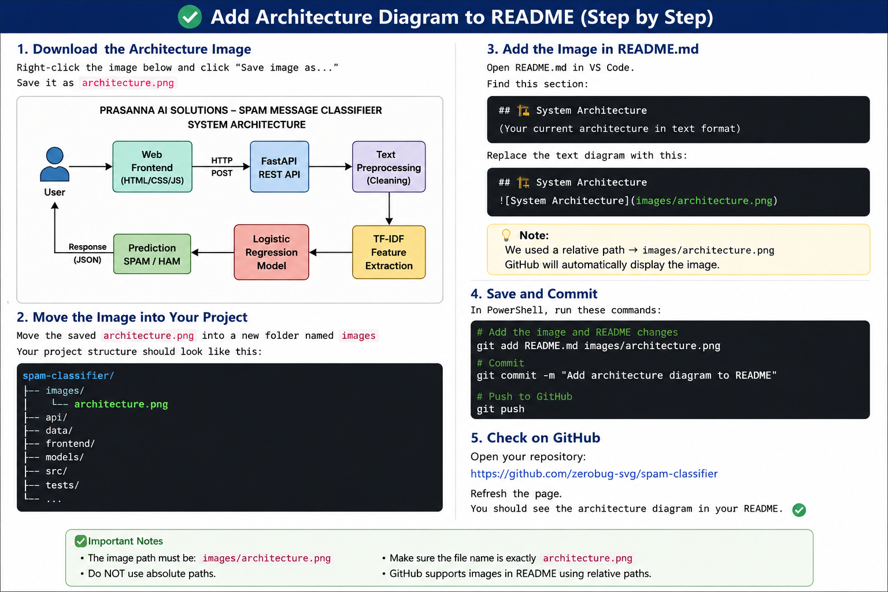

# 🚀 Prasanna AI Solutions — Spam Message Classifier

> An end-to-end AI/ML application that detects whether a text message is **Spam** or **Ham (Normal)** using Natural Language Processing and Machine Learning.


---

## 🌐 Live Demo

### 🖥️ Web Application

(https://spam-classifier-frontend-8z0o.onrender.com)

### 🔧 Backend API

https://spam-classifier-latest-1.onrender.com

### 📚 Swagger API Documentation

https://spam-classifier-latest-1.onrender.com/docs

### ❤️ Health Check

https://spam-classifier-latest-1.onrender.com/health

---

## 📌 Project Overview

**Prasanna AI Solutions — Spam Message Classifier** is an end-to-end Machine Learning application designed to classify text messages as:

- 🚨 **Spam**
- ✅ **Ham / Normal Message**

The project demonstrates the complete lifecycle of an AI/ML application, from data preprocessing and model training to API development, testing, Docker containerization, CI/CD and cloud deployment.

---

## 🔄 End-to-End Workflow

```text
Dataset
   ↓
Data Cleaning
   ↓
Text Preprocessing
   ↓
TF-IDF Feature Extraction
   ↓
Logistic Regression
   ↓
Model Evaluation
   ↓
Model Serialization
   ↓
FastAPI
   ↓
Pytest
   ↓
Docker
   ↓
GitHub Actions
   ↓
GitHub Container Registry
   ↓
Render Cloud Deployment
   ↓
Web Frontend

---

## 🏗️ System Architecture



---
```text
User
  ↓
Web Frontend
  ↓
FastAPI
  ↓
Text Preprocessing
  ↓
TF-IDF
  ↓
Logistic Regression
  ↓
Spam / Ham Prediction